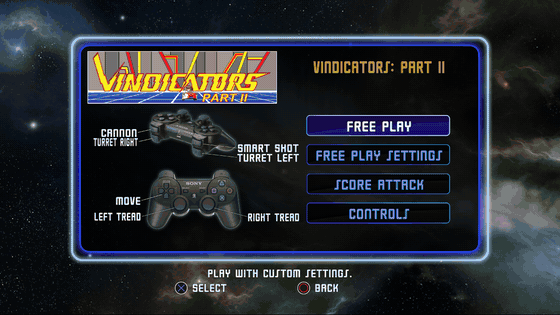
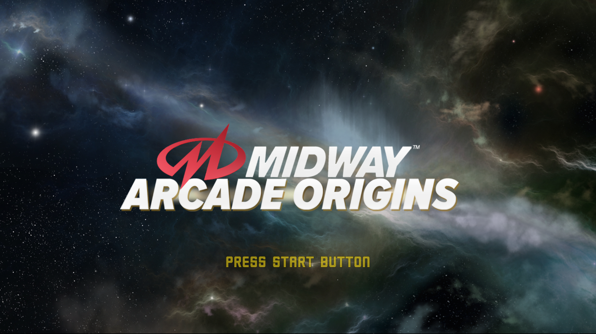
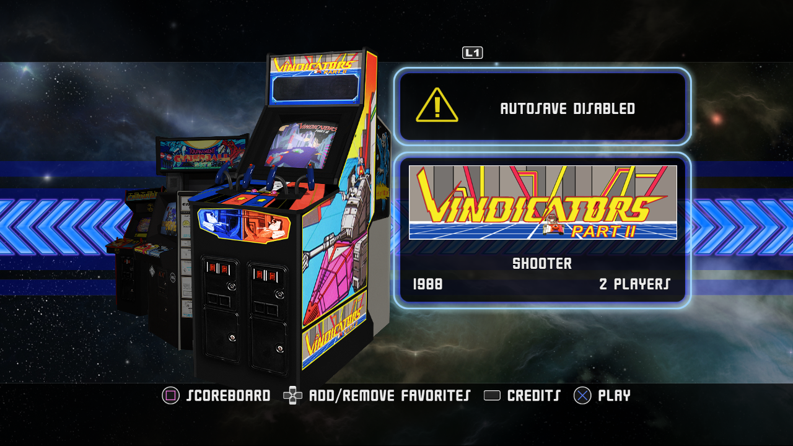
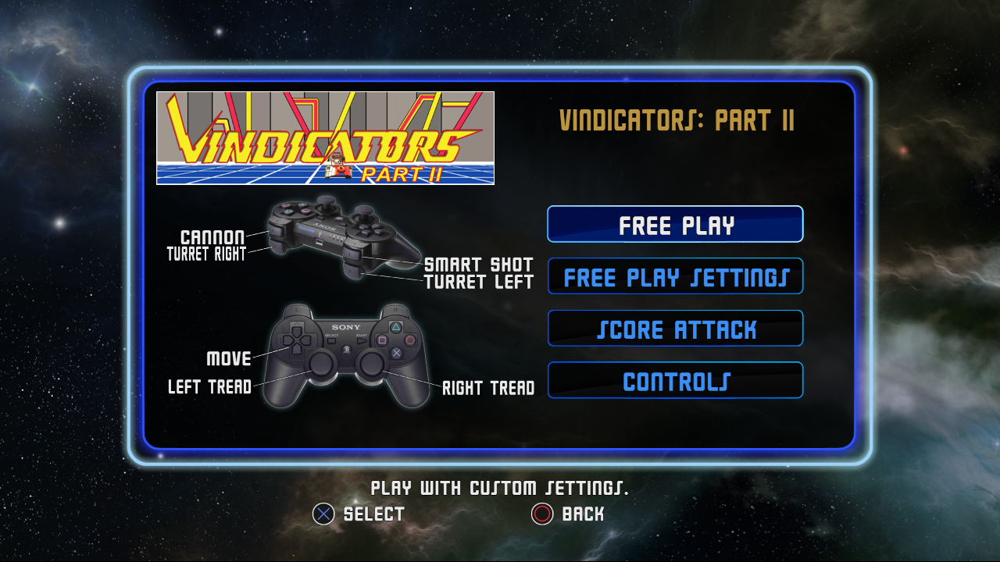
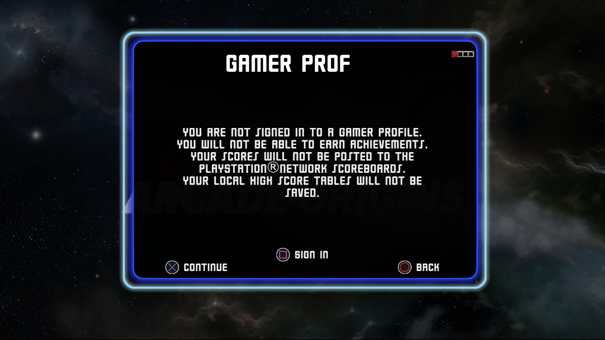
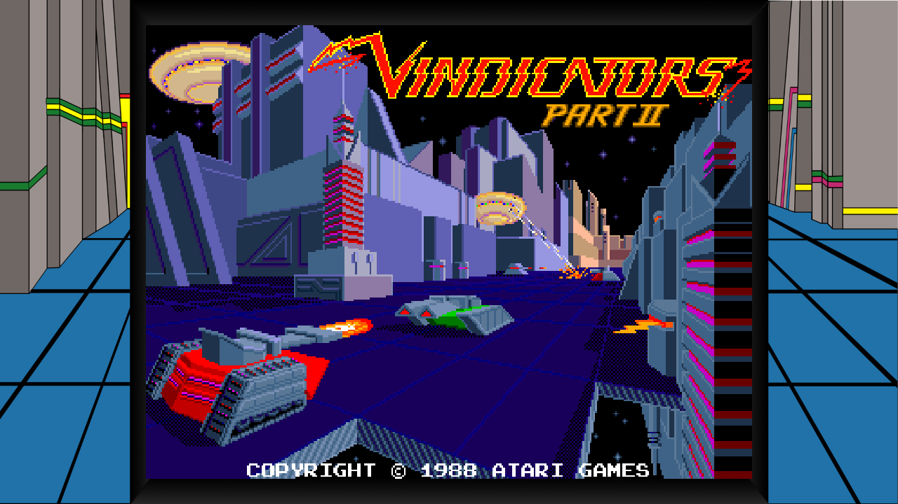
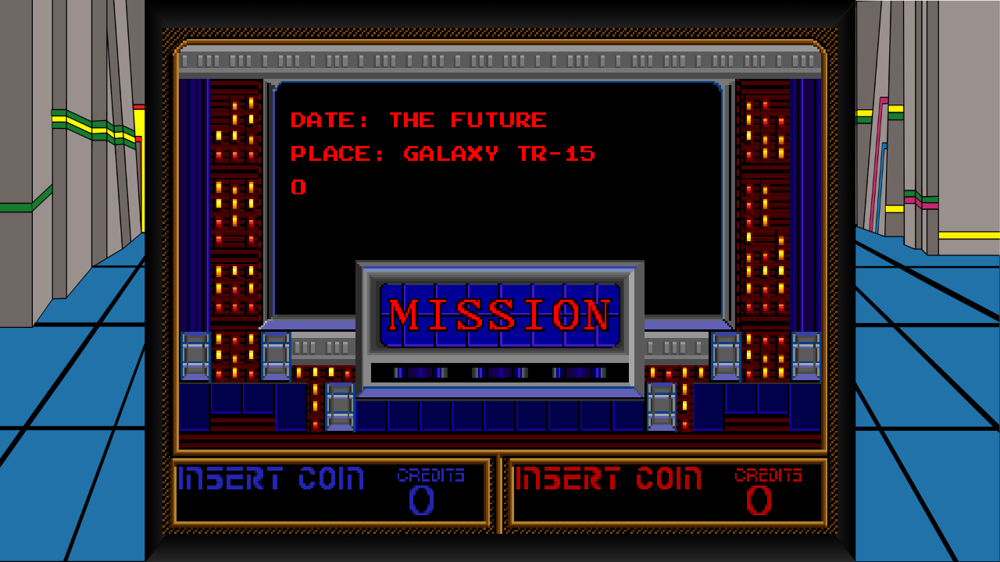

# midway — Midway Arcade Origins (PS3), static recompilation

`BLUS31083`, disc release (Backbone Entertainment / Warner Bros., 2012): 30-odd
Midway and Atari arcade games behind a 3D front end. Recompiled to native
Windows with [ps3recomp](https://github.com/sp00nznet/ps3recomp), in the same
house style as its sister ports
[gh3](https://github.com/sp00nznet/gh3), [tornado](https://github.com/sp00nznet/tornado),
[crazytaxi-ps3](https://github.com/sp00nznet/crazytaxi-ps3) and
[simpsonsarcade-ps3](https://github.com/sp00nznet/simpsonsarcade-ps3).



| | |
|---|---|
|  |  |
|  |  |
|  |  |

## Status

**Alpha — in game.** Boots through the logo movies (skipped: nothing decodes
them), the title screen, the profile notice and the game carousel, then loads
an arcade ROM set and runs it: Vindicators Part II plays its attract loop inside
the bezel art at about 25 fps. Coin input registers.

| Area | State |
|---|---|
| EBOOT decrypt | Works (disc EBOOT, `decrypt_self.py`) |
| PPU lift | 10,060 functions, 191 imports across 18 libraries, builds first time |
| SPU | No embedded ELF images; two raw SPURS render jobs (41,856 B and 816 B) cut from `.data` and lifted, 0 MISSes |
| Graphics | Title, menus, carousel and the emulated game render correctly; 0 dropped draws |
| Movies (`cellSail`) | Not decoded; each AVI is reported as played-to-end |
| Audio | Not checked |
| Input | START, CROSS, SELECT (coin) register. Each game opens a menu (Free Play, Score Attack, Controls); pressing CROSS through it hasn't yet produced a played credit |

Next steps are in [ROADMAP.md](ROADMAP.md); what was fixed and how it was found
is in [docs/progress.md](docs/progress.md).

## Getting Started

You need your own copy of the game. No game code, data or keys come with this
repo, and the recompiled source isn't distributed: you generate it locally from
your own dump.

Prerequisites (Windows 11):

- Visual Studio 2022 with the C++ workload and **clang-cl** (LLVM component)
- CMake ≥ 3.20, Ninja, Python 3.11+ with `pycryptodome`
- Git Bash (for `tools/relift.sh`)
- A checkout of [ps3recomp](https://github.com/sp00nznet/ps3recomp). The
  default path is `G:/recomp/ps3`; elsewhere, set `PS3RECOMP_DIR` (Windows
  path, for `build.py`) and `PS3RECOMP` (Git Bash path, for `relift.sh`).
  It needs `build-gate/ps3recomp_runtime.lib` built. The checkout's
  `libs/spurs/cellSpurs.c` needs the Join fix from
  [#185](https://github.com/sp00nznet/ps3recomp/pull/185), and
  `libs/codec/cellSail.c` the `STATE_CHANGED` events from
  [#190](https://github.com/sp00nznet/ps3recomp/pull/190); both
  files are compiled into this port from the checkout, see `CMakeLists.txt`.
- A SELF decrypter: [`tools/decrypt_self.py`](https://github.com/sp00nznet/twistedmetal/blob/main/tools/decrypt_self.py)
  from twistedmetal plus a scetool-format key file with the `appldr` keys (not
  supplied), or RPCS3 (`rpcs3 --decrypt EBOOT.BIN`)

Steps:

1. Extract the disc so the tree is `vfs/PS3_GAME/...` (`PARAM.SFO`,
   `USRDIR/EBOOT.BIN`, `USRDIR/0B/*.SR`, the three AVIs).
2. Decrypt the EBOOT, and put a copy next to the original:

   ```bash
   python path/to/twistedmetal/tools/decrypt_self.py vfs/PS3_GAME/USRDIR/EBOOT.BIN \
       --keys path/to/keys -o game/EBOOT.elf
   cp game/EBOOT.elf vfs/PS3_GAME/USRDIR/EBOOT.elf
   ```

3. Lift and generate: `./tools/relift.sh` (writes `imports.json`, `analysis/`,
   `src/recomp/`, `src/gen/`, `spu_miss/`, `src/spu_gen/`; about a minute).
4. Build: `python build.py` (configures CMake + Ninja under the MSVC
   environment and builds `build/midway.exe`, Release; a few minutes).
5. Run:

   ```bash
   PS3_VFS_ROOT=vfs RSX_LIVE_DRAW=1 PS3_MAIN_STACK_LV2=1 \
       ./build/midway vfs/PS3_GAME/USRDIR/EBOOT.elf
   ```

   A 1280x720 window opens: black for a few seconds while the logo movies are
   skipped, then "PRESS START BUTTON". The window title shows FPS, draws per
   frame and size.

## Usage

Headless (no window; works over RDP), START at the title, CROSS through the
profile notice and the carousel into Vindicators Part II, a frame every 300
flips to `scratch/fr/` (the directory must exist):

```bash
mkdir -p scratch/fr
PAD_SCRIPT="15:0x0008,25:0x4000,32:0x4000,39:0x4000,46:0x4000,53:0x4000" \
LD_FRAME_DUMP=scratch/fr LD_FRAME_DUMP_EVERY=300 \
PS3_VFS_ROOT=vfs RSX_LIVE_DRAW=1 PS3_MAIN_STACK_LV2=1 \
    ./build/midway --headless vfs/PS3_GAME/USRDIR/EBOOT.elf
```

`--record out.mp4` pipes frames to ffmpeg; let the program exit on its own or
the MP4 has no index. Pad masks: START `0x0008`, CROSS `0x4000`, SELECT
`0x0001`. `PAD_SCRIPT` times are wall-clock, so a slow boot can move a press
onto a different screen.

## Building from source

Steps 3 and 4 above. Run `tools/relift.sh` again whenever ps3recomp's lifter
changes, and `python build.py` when the runtime library or this repo changes.
`--code-end 0x2525AC` in `relift.sh` matters: it sits just past the
`.lib.stub` trampolines, and `.rodata` follows in the same executable segment.

## License

[MIT](LICENSE), covering this repo's own build scripts and docs. Midway Arcade
Origins is © Warner Bros. Interactive; the arcade games are © their owners. The
screenshots are from the running recompilation and are here only to show
progress.
